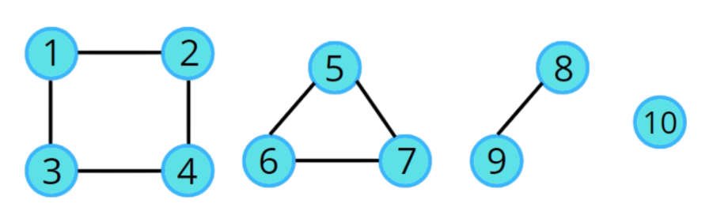

<a name="readme-top"></a>

<div align="center">

[![Contributors][contributors-shield]][contributors-url]
[![Forks][forks-shield]][forks-url]
[![Stargazers][stars-shield]][stars-url]
[![Issues][issues-shield]][issues-url]
[![LinkedIn][linkedin-shield]][linkedin-url]

</div>
<br />
<div align="center">
  <a href="https://github.com/Izaacapp/Disjoint-Set">
    
  </a>

  <h3 align="center">Disjoint Set Network Connectivity</h3>

  <p align="center">
    <br />
    <a href=https://github.com/Izaacapp/Disjoint-Set"><strong>Explore the docs »</strong></a>
    <br />
    <br />
    ·
    <a href="https://github.com/Izaacapp/Disjoint-Set/issues/new?labels=bug&template=bug-report---.md">Report Bug</a>
    ·
    <a href="https://github.com/Izaacapp/Disjoint-Set/issues/new?labels=enhancement&template=feature-request---.md">Request Feature</a>
  </p>
</div>

<details>
  <summary>Table of Contents</summary>
  <ol>
    <li><a href="#about-the-project">About The Project</a></li>
    <li><a href="#project-directory-structure">Project Directory Structure</a></li>
    <li><a href="#compilation-and-execution">Compilation and Execution</a></li>
    <li><a href="#sample-input-and-output">Sample Input and Output</a></li>
    <li><a href="#testing-strategy">Testing Strategy</a></li>
    <li><a href="#contributing">Contributing</a></li>
    <li><a href="#license">License</a></li>
    <li><a href="#contact">Contact</a></li>
    <li><a href="#acknowledgments">Acknowledgments</a></li>
  </ol>
</details>

## About The Project

This project involves using disjoint set data structures to solve the problem of reducing network connectivity by destroying connections.


## Project Directory Structure

**Source Files:**
- `src/main/java/Main.java`: The main Java program file containing the implementation of the solution.

**Test Cases:**
- `src/test/resources/destroy_10.in` & `destroy_10.out`
- `src/test/resources/destroy_sample_01.in` & `destroy_sample_01.out`
- `src/test/resources/destroy_sample_02.in` & `destroy_sample_02.out`
- `src/test/resources/test_results.log`: Log file to store the results of the test runs.

**Scripts:**
- `src/test/scripts/run_tests.sh`: Shell script to compile and run the tests.

**Documentation:**
- `docs/PA3 more hints.png`: Additional hints for the assignment.
- `docs/Plambeck_testStrategy.txt`: Testing strategy document.

**Resources:**
- `resources/Disjoint-Set.png`: Image for the README.

**Compiled Classes:**
- `bin/Main.class`
- `bin/Main$DisjointSet.class`

**Configuration Files:**
- `.gitignore`
- `README.md`
- `MIT-LICENSE.txt`

## Compilation and Execution

To compile and run the program along with the tests, follow these steps:

1. **Compile the Java Program:**
    ```bash
    javac Main.java
    ```

2. **Run the Tests:**
    ```bash
    ./run_tests.sh
    ```

This script will compile the Java program, run it against the provided input files, and compare the outputs with the expected results. The results of the tests will be logged in `test_results.log`.

## Sample Input and Output

### Test Case 1: Basic Functionality

**Input:**
```
3 3 3
1 2
1 3
2 3
3
1
2
```

**Expected Output:**
```
9
9
5
3
```

## Testing Strategy

The testing strategy is outlined in my `Plambeck_testStrategy.txt` file. It includes unit tests, integration tests, system tests, and performance tests to ensure the robustness and correctness of the program.

## Contributing

"An expert is a person who has made all the mistakes that can be made in a very narrow field." - Niels Bohr

Contributions are vital for progress. Fork the repo, create a feature branch, commit your changes, push, and open a pull request.

## License

Distributed under the MIT License. See `MIT-LICENSE.txt` for more information.

## Contact

Izaac Plambeck  
[Tweet me](https://x.com/Izaacapp)  
[Email me](mailto:izaacap@gmail.com) 

## Acknowledgments

* [University of Central Florida](https://www.ucf.edu/)
* [Java Documentation](https://docs.oracle.com/en/java/)

<p align="right">(<a href="#readme-top">back to top</a>)</p>

<!-- MARKDOWN LINKS & IMAGES -->
[contributors-shield]: https://img.shields.io/badge/Contributors-violet?style=for-the-badge
[contributors-url]: https://github.com/Izaacapp/Disjoint-Set/graphs/contributors
[forks-shield]: https://img.shields.io/badge/Forks-green?style=for-the-badge
[forks-url]: https://github.com/Izaacapp/Disjoint-Set/network/members
[stars-shield]: https://img.shields.io/badge/Stars-gold?style=for-the-badge
[stars-url]: https://github.com/Izaacapp/Disjoint-Set/stargazers
[issues-shield]: https://img.shields.io/badge/Issues-red?style=for-the-badge
[issues-url]: https://github.com/Izaacapp/Disjoint-Set/issues
[license-shield]: https://img.shields.io/github/license/Izaacapp/Disjoint-Set.svg?style=for-the-badge
[license-url]: https://github.com/Izaacapp/Disjoint-Set/blob/master/LICENSE.txt
[linkedin-shield]: https://img.shields.io/badge/-LinkedIn-black.svg?style=for-the-badge&logo=linkedin&colorB=555
[linkedin-url]: https://www.linkedin.com/in/izaac-plambeck/